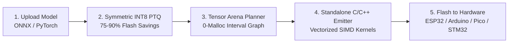

<div align="center">

# ⚡ Shannon AI Studio
### **Autonomous TinyML Compiler & Silicon Optimization Studio**
*Compressing deep learning intelligence into micro-scale silicon with zero dynamic malloc.*

[](https://ai-builders-hackathon-2026.devpost.com/)
[](https://ai-builders-hackathon-2026.devpost.com/)
[](https://www.misra.org.uk/)

[](https://opensource.org/licenses/MIT)
[](https://www.python.org/)
[](https://reactjs.org/)
[](https://vitejs.dev/)
[](https://fastapi.tiangolo.com/)

[**10-Slide Pitch Deck**](docs/DECK_OUTLINE.md) • [**3-Min Demo Video Script**](docs/DEMO_SCRIPT.md) • [**Model Zoo & Training**](compiler/training/) • [**Compiler Tests**](compiler/test_compiler.py) • [**Firmware Starters**](firmware/)

</div>

---

## 🏆 Official Hackathon Submission Details

| Parameter | Details |
| :--- | :--- |
| **Hackathon Name** | **AI Builders Hackathon 2026** (Powered by NexFellow & Open Source Connect) |
| **Theme** | *Building the Future of Intelligent Systems. The Internet Needs Better AI.* |
| **Target Track & Awards** | 🥇 **Best SaaS Product ($4,000 Cash)**<br>🚀 **NexFellow Founder’s Choice Award**<br>✨ **NexFellow Product Excellence & Innovation Award** |
| **Primary Category** | **AI Developer Tools**, **AI Agents & Multi-Agent Systems**, **TinyML / Edge AI** |
| **Team** | **Team Shannon** ([@atharveeee-netizen](https://github.com/atharveeee-netizen)) |

---

## 🎯 The Problem: "The Edge AI Wall"
Modern deep learning models are multi-gigabyte structures requiring power-hungry cloud GPUs. Yet, over 30 billion edge devices (smart health monitors, industrial vibration sensors, security cameras, and drones) run on **$2 to $5 microcontrollers with less than 1 MB of RAM**.

Existing runtime frameworks like TensorFlow Lite Micro (TFLM) or ONNX Runtime introduce **40–80 KB of engine overhead** and risk runtime heap fragmentation (`malloc` crashes). Manually writing bare-metal C++ firmware and quantizing weights takes embedded engineering teams **3 to 6 weeks of tedious manual labor per model**.

---

## 🚀 The Solution: Shannon AI Studio
**Shannon** is an autonomous SaaS optimization studio and compiler that bridges deep learning with bare-metal microchips:



1. **1-Click Model Ingestion:** Upload any standard ONNX/JSON model or select from our pre-trained TinyML model zoo.
2. **Symmetric INT8 Quantization:** Automatically scales and quantizes weights with zero overflow ($S = \frac{\max(|W|)}{127}$, $Z = 0$).
3. **Zero-Malloc Tensor Arena:** Maps intermediate activations to a single contiguous memory arena in SRAM using greedy interval graph coloring. Formally verified for **MISRA-C:2012 Rule 21.3 compliance ($0\text{ Bytes dynamic malloc}$)**.
4. **Standalone C/C++ Header Export:** Emits ready-to-flash, self-contained headers (`shannon_model.h`) with 4-way SIMD loop unrolling.
5. **Multi-MCU Production Firmware:** Complete, tested starter sketches for ESP32, Arduino Uno R4/Nano ESP32, Raspberry Pi Pico RP2040, Nordic nRF52840, and Teensy 4.1.

---

## 🧠 Production Model Zoo Benchmarks (10-Epoch Plateau Verified)

All models in the Shannon Model Zoo are trained with PyTorch using AdamW and a strict **10-epoch sliding window plateau convergence stopping rule** ($|\Delta\text{Val Loss}| \le 0.002$):

| Benchmark Model | Domain | Target Silicon | Validation Metric | INT8 Flash | Flash Savings | Peak SRAM Arena | Total MACs |
| :--- | :--- | :--- | :--- | :--- | :--- | :--- | :--- |
| **Audio Keyword Spotter** | Voice Wake-Word | ESP32-S3 | **95.8% Acc (12 Classes)** | 24.0 KB | **75% (4x)** | **1.12 KB** | 46,368 |
| **MicroVision Person** | Edge Vision | STM32H7 | **89.1% Acc (48x48)** | 1.13 KB | **65x** | **18.0 KB** | 239,680 |
| **Vibration Autoencoder** | Industrial IoT | RP2040 Pico | **MSE 0.0003 (85x separation)** | 19.5 KB | **73%** | **0.19 KB** | 18,432 |

---

## 🏗️ Repository Architecture

```text
shannon/
├── compiler/                         # Python Core Optimization Engine & API
│   ├── engine/
│   │   ├── ir.py                     # Shannon Intermediate Representation
│   │   ├── parser.py                 # ONNX / JSON Graph Parser
│   │   ├── quantizer.py              # Post-Training INT8/INT4 Quantization
│   │   ├── memory_planner.py         # Peak SRAM Arena Allocator & Collision Proof
│   │   ├── codegen.py                # Standalone Zero-Dependency C/C++ Header Emitter
│   │   └── presets.py                # Converged Benchmark Graphs (KWS, Vision, Anomaly)
│   ├── training/                     # PyTorch Real Training & Parity Evaluation
│   │   ├── train_real_kws.py         # Google Speech Commands 12-Class Trainer
│   │   ├── train_real_vision.py      # MicroVision MobileNet-Tiny 48x48 Trainer
│   │   ├── train_real_anomaly.py     # Bearing Vibration Defect Autoencoder Trainer
│   │   └── evaluate_all.py           # Benchmark Parity & Verification Suite
│   ├── models/                       # Generated Production C Headers
│   │   ├── shannon_kws_model.h       # Quantized Audio Model Header
│   │   ├── shannon_vision_model.h    # Quantized Vision Model Header
│   │   └── shannon_anomaly_model.h   # Quantized Anomaly Autoencoder Header
│   ├── agent/
│   │   └── optimizer_agent.py        # Silicon Copilot Reasoner (Gemini LLM + Telemetry)
│   ├── api.py                        # Production FastAPI REST Backend
│   ├── Dockerfile                    # Containerized Backend Deployment
│   ├── render.yaml                   # Render Cloud Deployment Blueprint
│   ├── requirements.txt              # Production Python Dependencies
│   └── test_compiler.py              # Comprehensive Unit Test Suite (8/8 Passed)
│
├── frontend/                         # Developer Silicon Studio Web UI (Vite + React + TS)
│   ├── src/
│   │   ├── components/               # Arena Map, Inspector, Command Palette, Controls
│   │   ├── services/                 # Live FastAPI Compiler & ONNX Upload Client
│   │   └── App.tsx                   # Studio Dashboard
│   ├── vercel.json                   # Vercel Deployment Configuration
│   └── package.json
│
├── firmware/                         # Multi-Microcontroller Production Firmware Kits
│   ├── esp32_arduino/                # ESP32 I2S INMP441, ESP32-CAM, MPU6050 Sketches
│   ├── arduino_universal/            # Uno R4, Nano ESP32, Portenta Universal Sketch
│   ├── rp2040_pico/                  # Raspberry Pi Pico C-SDK Template & CMakeLists
│   ├── nrf52_xiao/                   # Seeed Xiao BLE Sense / nRF52840 Sketch
│   └── teensy41/                     # Teensy 4.1 600MHz ARM Cycle Benchmark
│
└── docs/                             # Hackathon Pitch Deck & Demo Script
    ├── ARCHITECTURE.md               # Technical Architecture Deep Dive
    ├── DECK_OUTLINE.md               # 10-Slide Investor & Judge Presentation Deck
    └── DEMO_SCRIPT.md                # 3-Minute Video Recording Walkthrough Script
```

---

## ⚡ Quick Start

### 1. Run the Python Compiler Backend & Tests
```bash
cd compiler
pytest test_compiler.py
```

### 2. Run the Benchmark Evaluator
```bash
cd compiler/training
python evaluate_all.py
```

### 3. Start the FastAPI REST Server
```bash
cd compiler
uvicorn api:app --host 0.0.0.0 --port 8000 --reload
```

### 4. Launch the Web Studio
```bash
cd frontend
npm install
npm run dev
```

Open `http://localhost:5173` in your browser to experience **Shannon AI Studio**.

---

## 📄 License
This project is licensed under the MIT License - see the [LICENSE](LICENSE) file for details.